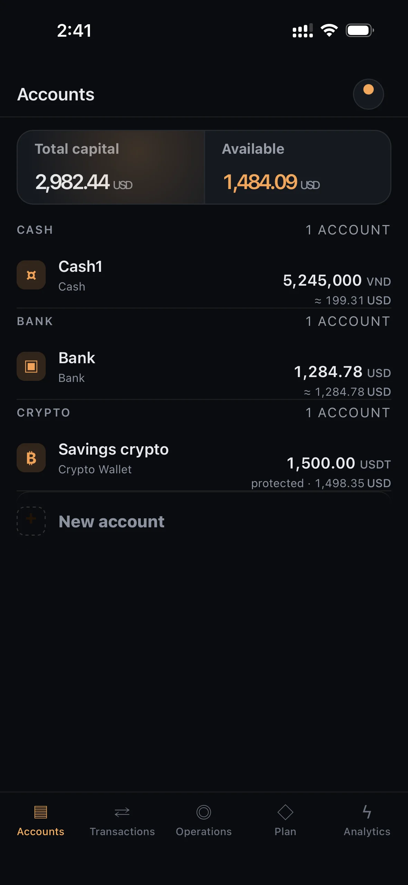
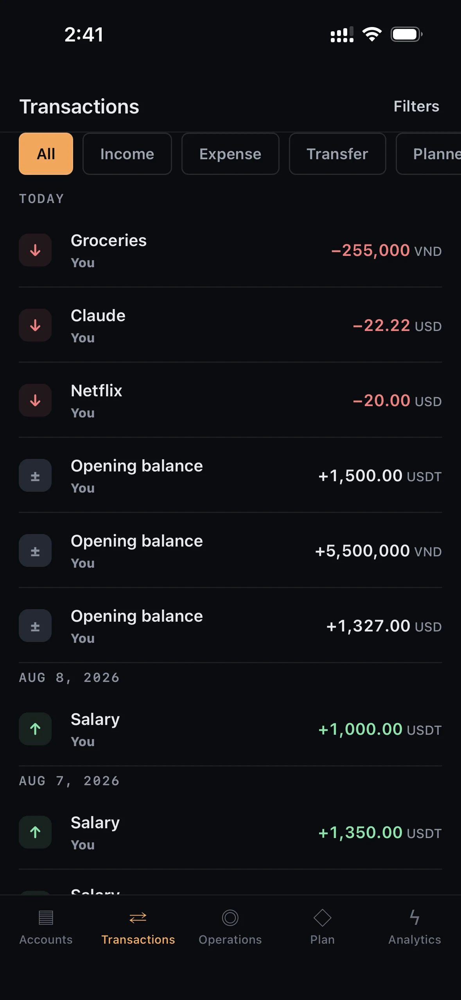
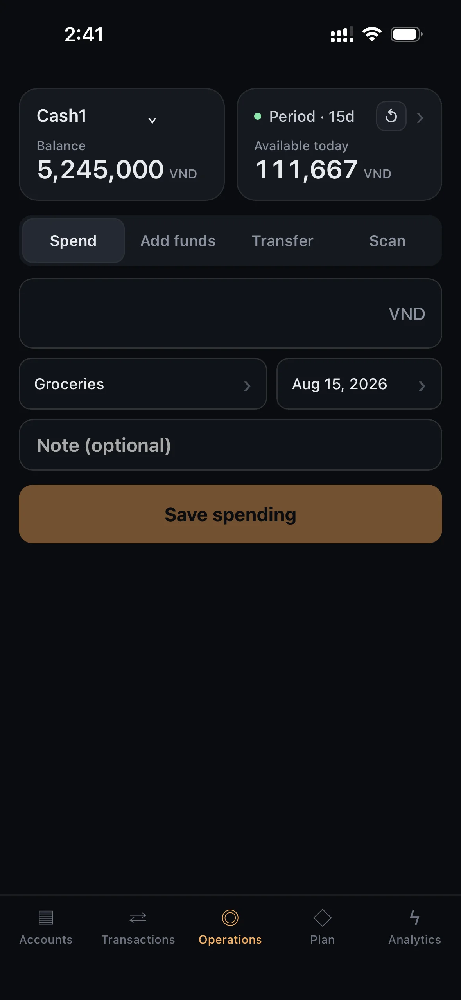

# FinApp v2

FinApp v2 is a single-container personal and shared finance tracker: a FastAPI
backend with a vanilla-JS single-page app, storing money and exchange rates as
`Decimal` in SQLite. It provides Main-currency valuation with manual rates,
action-first Operations with persistent Undo, account-specific budget periods,
ledger history with soft delete, and a future-events Plan with Link/Skip.

The single-page app on mobile:

| Accounts | Transactions | Operations |
|---|---|---|
|  |  |  |

The authoritative product and technical specification and the release process
live under [`docs/`](docs/README.md):

- [`docs/specs/FinnApp-v2.md`](docs/specs/FinnApp-v2.md) — product and technical
  target;
- [`docs/BUILD_PLAN-v2.md`](docs/BUILD_PLAN-v2.md) — Phase 8–13 implementation
  order;
- [`docs/REVIEW_PROTOCOL-v2.md`](docs/REVIEW_PROTOCOL-v2.md) — independent
  reviewer-subagent gate for every logical block;
- [`docs/PROGRESS.md`](docs/PROGRESS.md) — release checkpoint and evidence; and
- [`docs/specs/MANUAL_TEST_CASES-v2.md`](docs/specs/MANUAL_TEST_CASES-v2.md) —
  manual release acceptance.

## Requirements

- Python 3.12, or Docker with Compose v2.
- No Redis, worker, queue, message broker, or other external service.
- SQLite is the only database; it ships through `aiosqlite`.

## Install and run locally

```sh
python3.12 -m venv .venv
source .venv/bin/activate

# Runtime only:
pip install -r requirements.txt
# Runtime plus the test stack (pytest, pytest-asyncio, httpx):
pip install -r requirements-dev.txt

alembic upgrade head
uvicorn app.main:app --reload
```

Open <http://127.0.0.1:8000>. API documentation is at
<http://127.0.0.1:8000/docs>; `GET /health` is public and returns
`{"status":"ok"}`.

The default database is `./finapp.db`. To keep it out of the way, point
`DATABASE_URL` at an absolute async SQLite URL (four slashes = absolute path):

```sh
DATABASE_URL=sqlite+aiosqlite:////tmp/finapp-v2.db alembic upgrade head
DATABASE_URL=sqlite+aiosqlite:////tmp/finapp-v2.db uvicorn app.main:app
```

For HTTPS deployments set `COOKIE_SECURE=true` so auth cookies keep the `Secure`
flag; terminate TLS in an external reverse proxy, not in the app or Compose.

## Migrate

Alembic owns the schema. `alembic upgrade head` creates the release tables and
seeds the eight assets (VND, USD, RUB, EUR, USDT, BTC, ETH, TRX). Under Docker
the container runs the migration automatically before Uvicorn starts, and a
migration failure prevents the server from starting.

## Test

```sh
.venv/bin/python -m pytest -q
node --check app/static/app.js
.venv/bin/pip check
git diff --check
```

## Docker

The release ships as one non-root Python 3.12 container. SQLite persists on a
volume at `/data/finapp.db`; the container runs `alembic upgrade head` and then
Uvicorn on port 8000, with `/health` as its healthcheck.

### Build

```sh
docker build -t finapp-v2 .
```

### Start with Compose

```sh
docker compose up -d
```

Compose runs exactly one application replica, publishes port 8000, and mounts
the named volume `finapp-data` at `/data`. Check status and health:

```sh
docker compose ps
curl -s http://127.0.0.1:8000/health
```

Stop the app while keeping data:

```sh
docker compose down          # removes the container and network, keeps the volume
```

### Data persistence

The `docker run` backup and restore commands below use the full volume name
`fin_app_finapp-data`, which Compose derives from the project name (the
directory, `fin_app`) plus the `finapp-data` key. If you run Compose from a
directory with a different name, replace the `fin_app_` prefix with your project
name — `docker compose config --volumes` prints the exact name.

Application data lives only in the named `finapp-data` volume, never in the
image. It survives `docker compose restart`, `docker compose down` followed by
`docker compose up`, and image rebuilds. Removing the volume — `docker compose
down -v` or `docker volume rm fin_app_finapp-data` — permanently deletes the
database, so back it up first.

### Backup

Copy the live SQLite file out of the volume. Stopping the app first guarantees a
quiet, consistent copy:

```sh
docker compose stop app
docker run --rm \
  -v fin_app_finapp-data:/data \
  -v "$(pwd)/.backups:/backup" \
  busybox sh -c 'cp /data/finapp.db "/backup/finapp-$(date +%Y%m%dT%H%M%SZ).db"'
docker compose start app
```

The backup file lands in `.backups/` on the host. Record its SHA-256 checksum
(`shasum -a 256 .backups/finapp-*.db`) alongside the copy.

### Restore

Stop the app and copy a backup file back into the volume as `finapp.db`. The
container runs as UID 10001, so the restored file and any stale SQLite sidecar
files must be given that ownership or the app cannot write to the database:

```sh
docker compose stop app
docker run --rm \
  -v fin_app_finapp-data:/data \
  -v "$(pwd)/.backups:/backup" \
  busybox sh -c '
    rm -f /data/finapp.db-wal /data/finapp.db-shm /data/finapp.db-journal &&
    cp /backup/<backup-file>.db /data/finapp.db &&
    chown 10001:10001 /data/finapp.db'
docker compose start app
```

Verify the restore with `curl -s http://127.0.0.1:8000/health` and by logging
in. On a first-time restore into a fresh stack, run `docker compose up -d`
before the copy so the volume exists, then repeat the copy and restart.

## First-release boundary

The target includes Main currency and manual valuation rates, Operations,
account-specific periods, revised Transactions and Plan behavior, and this
single-container Docker deployment. Blockchain/exchange synchronization, real
Scan/OCR, full Analytics reports, XLSX export, external market-rate providers,
bank APIs, Telegram, Google Sheets, pools, goals, and category limits remain
future work.
